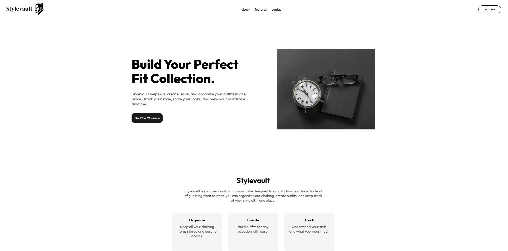
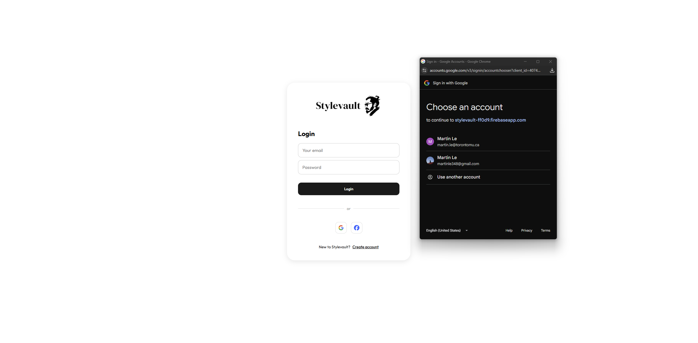
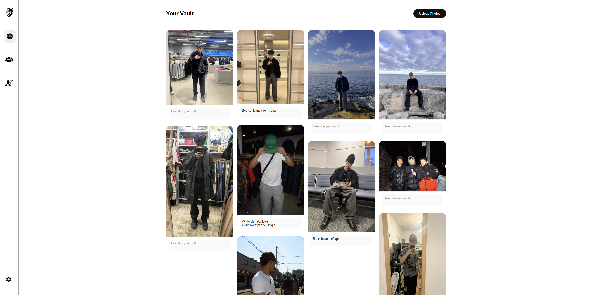
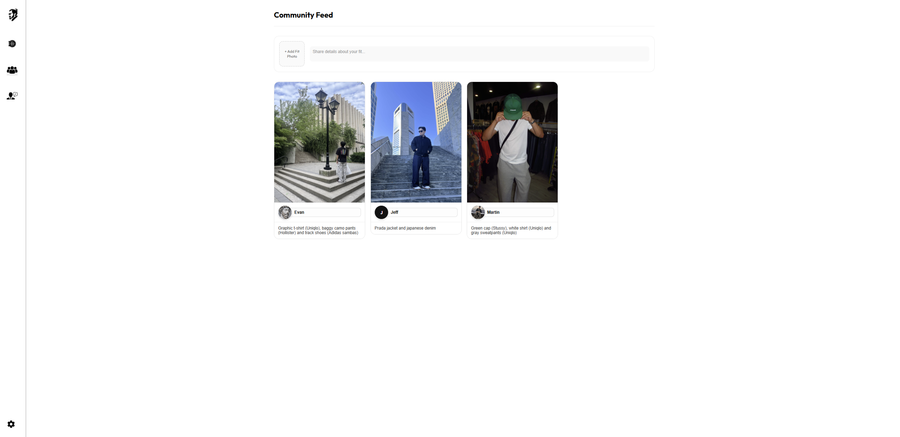

# Stylevault
A full-stack web application for uploading, categorizing, and securely managing private image collections and media vaults.

Running the web app locally:

Open two terminal windows:
- Terminal 1: npm run dev
- Terminal 2: python app.py

# Screenshots

